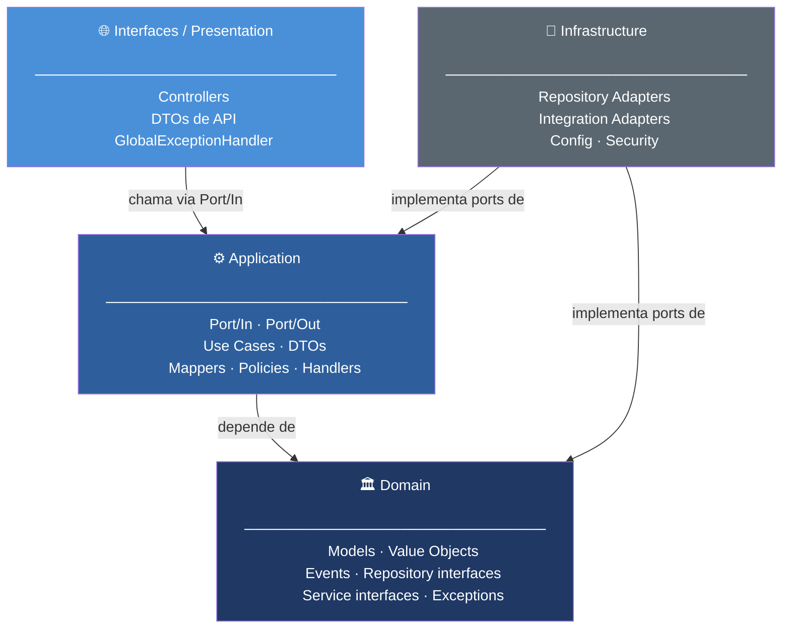

# Fluxo de Desenvolvimento em Arquitetura Hexagonal / Clean Architecture

Este documento descreve uma ordem recomendada de criação de arquivos e componentes em novos desenvolvimentos, respeitando as dependências entre as camadas da Arquitetura Hexagonal / Clean Architecture e alguns padrões de projeto.

A ideia é que ele seja genérico, podendo ser aplicado em diferentes projetos (não acoplado a um domínio específico), com foco em **Java + Spring Boot**.

---

## Diagrama de Dependências

> **Como ler:** as setas indicam **"depende de"**. Quanto mais ao centro, menos dependências a camada tem. O Domain não depende de ninguém.



**Regras fundamentais:**
- **Domain** não depende de nenhuma outra camada
- **Application** depende apenas do Domain
- **Infrastructure** depende de Domain e Application — implementa as interfaces (ports) que elas definem
- **Presentation** depende apenas de Application — chama use cases via `Port/In`

---

## 1. Domain (Domínio)

Camada que contém as regras de negócio centrais e os modelos principais do sistema.

### Estrutura sugerida

```
domain/
└── [contexto]/
    ├── model/         → Entidades (têm identidade e ciclo de vida)
    ├── vo/            → Value Objects (sem identidade, imutáveis)
    ├── event/         → Eventos de domínio (ex.: PedidoCriadoEvent)
    ├── repository/    → Interfaces de repositório (ports)
    └── service/       → Serviços de domínio (idealmente expostos como interfaces)
domain/
└── exception/         → Exceções específicas do domínio
```

> **Regra de ouro:** a camada de domínio não depende de nenhuma outra camada.

### Por que separar `model/` de `vo/`?

Entidades têm identidade (possuem um ID e ciclo de vida). Value Objects não têm identidade — são definidos pelos seus atributos e devem ser imutáveis. Misturá-los no mesmo pacote obscurece esse contrato fundamental do DDD.

### Eventos de Domínio

Eventos de domínio permitem que a camada de domínio comunique o que aconteceu sem depender de nada externo. São essenciais para desacoplar side-effects (notificações, logs, integrações).

```
PedidoCriadoEvent
EstoqueAtualizadoEvent
UsuarioRemovidoEvent
```

---

## 2. Application (Aplicação)

Camada que implementa os casos de uso da aplicação, orquestrando o domínio e os ports. É onde a lógica de aplicação vive — não a lógica de negócio puro.

### Estrutura da Camada

```
application/
└── [contexto]/
    ├── port/
    │   ├── in/        → Input ports: interfaces dos use cases (ex.: InserirPedidoUseCase)
    │   └── out/       → Output ports: interfaces de saída (ex.: NotificarClientePort, StoragePort)
    ├── use_cases/     → Implementações concretas dos use cases
    ├── dto/           → Request e Response DTOs de cada caso de uso
    ├── mapper/        → Conversores entre DTOs e modelos do domínio
    ├── assembler/     → Montagem de objetos complexos (aggregates, read models)
    ├── applier/       → Aplicação de transformações sobre entidades (PATCH/PUT)
    ├── policy/        → Regras de negócio reutilizáveis e stateless
    └── handler/       → Tratamento de eventos ou ações da aplicação
```

#### Por que separar `port/in` e `port/out`?

Explicitar os ports fecha o ciclo de Ports & Adapters de forma completa:

```
application/pedido/port/in/InserirPedidoUseCase.java     ← interface (input port)
application/pedido/port/out/NotificarClientePort.java    ← interface (output port)
application/pedido/use_cases/InserirPedidoUseCaseImpl.java
infrastructure/pedido/integration/EmailNotificacaoAdapter.java ← implementa port/out
```

Isso permite trocar qualquer adaptador de infraestrutura sem tocar na aplicação, e facilita testes com mocks dos ports.

### Componentes de Suporte

| Componente | Responsabilidade |
|---|---|
| `dto/` | Dados de entrada e saída dos use cases; evitam expor entidades do domínio |
| `mapper/` | Conversão de dados entre DTOs e modelos de domínio; sem regra de negócio |
| `assembler/` | Montagem de objetos complexos e respostas compostas |
| `applier/` | Aplica dados de DTOs em entidades (útil para PATCH/PUT) |
| `policy/` | Regras de decisão reutilizáveis; sempre stateless |
| `handler/` | Reage a eventos de domínio ou de aplicação; coordena side-effects |

> **Resumo:** a camada de aplicação é a orquestração dos casos de uso. Ela delega — não implementa regras de negócio.

---

## 3. Infrastructure (Infraestrutura)

Camada que contém os adaptadores concretos e os detalhes técnicos de implementação.

### Estrutura sugerida

```
infrastructure/
└── [contexto]/
    ├── persistence/   → Implementações dos repositórios do domínio
    ├── mapper/        → Mappers entre modelos de persistência e modelos de domínio
    ├── integration/   → Clientes e adapters para sistemas externos (APIs, filas, etc.)
    ├── security/      → Autenticação, autorização
    └── config/        → Configurações de frameworks, bibliotecas, logging, mensageria
```

> A infraestrutura implementa ports do domínio e da aplicação, mas não é conhecida por eles.

### Convenções Spring Boot

- Repositórios de infraestrutura: `@Repository` (Spring gerencia exceções de persistência).
- `@Transactional` pertence à camada de **aplicação** (use cases), não à infraestrutura. O use case define o escopo transacional.
- Use cases: `@Service` ou `@Component`.
- Sempre prefira **injeção via construtor** — facilita testes unitários sem contexto Spring.

---

## 4. Interfaces / Presentation

Camada que expõe as interfaces com o mundo externo (usuários, outros sistemas, etc.).

### Estrutura sugerida

```
interfaces/
└── [contexto]/
    ├── controllers/   → Controllers REST, GraphQL, mensageria, CLI, etc.
    ├── dtos/          → DTOs de API (payload JSON/XML — podem diferir dos DTOs de aplicação)
    └── exception/     → GlobalExceptionHandler com @RestControllerAdvice
```

> **Regra:** controllers chamam use cases via `Port/In`, nunca repositórios nem serviços de infraestrutura diretamente.

### GlobalExceptionHandler

O handler de exceções mapeia exceções de domínio para respostas HTTP sem vazar stack traces:

```java
@RestControllerAdvice
public class GlobalExceptionHandler {

    @ExceptionHandler(DomainException.class)
    public ResponseEntity<ErrorResponse> handleDomainException(DomainException ex) {
        return ResponseEntity.status(HttpStatus.UNPROCESSABLE_ENTITY)
            .body(new ErrorResponse(ex.getMessage()));
    }
}
```

---

## 5. Shared (Compartilhado)

Componentes e recursos reutilizáveis entre diferentes contextos ou camadas, desde que não violem as dependências.

```
shared/
├── utils/       → Classes utilitárias genéricas (datas, strings, números, etc.)
└── constants/   → Constantes compartilhadas (mensagens, códigos de erro, chaves de config)
```

---

## Services vs Policies

### Domain Services (Serviços de Domínio)

- Vivem em `domain/[contexto]/service/`
- Implementam operações de negócio que não pertencem a uma única entidade
- Podem coordenar múltiplas entidades do domínio
- Idealmente expostos como interfaces para facilitar testes e troca de implementação

### Policies (Políticas de Negócio na Aplicação)

- Vivem em `application/[contexto]/policy/`
- Encapsulam regras específicas e reutilizáveis de negócio — muitas vezes decisões binárias ou cálculos pontuais
- Sempre **stateless** e focadas em uma única responsabilidade
- Normalmente implementações concretas (não precisam de interface)

### Principais Diferenças

| Aspecto | Domain Service | Policy |
|---|---|---|
| **Escopo** | Contrato de negócio; parte do modelo de domínio | Regra aplicada em use cases; detalhe da camada de aplicação |
| **Responsabilidade** | Coordena operações entre entidades de domínio | Implementa uma regra específica de decisão/validação |
| **Reutilização** | Via interfaces do domínio | Injetada diretamente nos use cases |
| **Estado** | Preferencialmente stateless; pode ter algum estado | Sempre stateless |
| **Composição** | Pode depender de outros domain services | Pode compor outras policies; não acessa repositórios diretamente |

---

## Testes

### Pirâmide de Testes

| Nível | O que testar | Ferramentas sugeridas |
|---|---|---|
| **Unitário** | Use cases, Policies, Mappers, Domain Services, Appliers | JUnit 5 + Mockito |
| **Integração** | Repositórios com banco real | `@DataJpaTest` + Testcontainers |
| **Slice** | Controllers isolados | `@WebMvcTest` + MockMvc |
| **E2E / Sistema** | Fluxos completos | `@SpringBootTest` + Testcontainers |

### Testes de Arquitetura com ArchUnit

Use **ArchUnit** para validar programaticamente que as regras de dependência entre camadas estão sendo respeitadas:

```java
@AnalyzeClasses(packages = "com.empresa.projeto")
class ArchitectureTest {

    @ArchTest
    static final ArchRule dominioNaoDeveDependerDeInfraestrutura =
        classes().that().resideInAPackage("..domain..")
            .should().onlyDependOnClassesThat()
            .resideInAnyPackage("..domain..", "java..", "jakarta..");

    @ArchTest
    static final ArchRule applicationNaoDeveDependerDeInfraestrutura =
        classes().that().resideInAPackage("..application..")
            .should().onlyDependOnClassesThat()
            .resideInAnyPackage("..application..", "..domain..", "java..", "jakarta..");

    @ArchTest
    static final ArchRule controllersChamamApenasUseCases =
        classes().that().resideInAPackage("..interfaces..")
            .should().onlyDependOnClassesThat()
            .resideInAnyPackage("..interfaces..", "..application..", "java..", "jakarta..");
}
```

---

## Anti-Patterns

Esta seção lista o que **não fazer** — padrões que violam as fronteiras arquiteturais ou comprometem a manutenibilidade.

### Camada errada para `@Transactional`

```java
// ❌ ERRADO — @Transactional no repositório define escopo errado
@Repository
public class PedidoRepositoryImpl implements PedidoRepository {
    @Transactional
    public void salvar(Pedido pedido) { ... }
}

// ✅ CORRETO — @Transactional no use case define o escopo transacional correto
@Service
public class InserirPedidoUseCaseImpl implements InserirPedidoUseCase {
    @Transactional
    public InserirPedidoResponse execute(InserirPedidoRequest request) { ... }
}
```

### Lógica de negócio no Controller

```java
// ❌ ERRADO — controller com lógica de negócio
@PostMapping("/pedidos")
public ResponseEntity<?> criarPedido(@RequestBody PedidoRequest request) {
    if (request.getValor() <= 0) throw new IllegalArgumentException("Valor inválido");
    if (estoqueService.verificar(request.getProdutoId()) == 0) {
        throw new IllegalStateException("Sem estoque");
    }
    // ...
}

// ✅ CORRETO — controller apenas delega ao use case
@PostMapping("/pedidos")
public ResponseEntity<PedidoResponse> criarPedido(@RequestBody PedidoRequest request) {
    var response = inserirPedidoUseCase.execute(mapper.toRequest(request));
    return ResponseEntity.status(HttpStatus.CREATED).body(response);
}
```

### Entidade de domínio como DTO de API

```java
// ❌ ERRADO — expõe entidade de domínio diretamente na resposta da API
@GetMapping("/pedidos/{id}")
public ResponseEntity<Pedido> buscarPedido(@PathVariable Long id) {
    return ResponseEntity.ok(pedidoRepository.findById(id));
}

// ✅ CORRETO — use case retorna DTO; controller não conhece entidade de domínio
@GetMapping("/pedidos/{id}")
public ResponseEntity<BuscarPedidoResponse> buscarPedido(@PathVariable Long id) {
    return ResponseEntity.ok(buscarPedidoUseCase.execute(new BuscarPedidoRequest(id)));
}
```

### Use Case chamando outro Use Case

```java
// ❌ ERRADO — acoplamento direto entre use cases
@Service
public class AtualizarPedidoUseCaseImpl {
    private final BuscarPedidoUseCaseImpl buscarPedidoUseCase; // dependência de impl!

    public void execute(AtualizarPedidoRequest request) {
        var pedido = buscarPedidoUseCase.execute(...);
        // ...
    }
}

// ✅ CORRETO — use case depende do repositório (domain port) diretamente
@Service
public class AtualizarPedidoUseCaseImpl {
    private final PedidoRepository pedidoRepository;

    public void execute(AtualizarPedidoRequest request) {
        var pedido = pedidoRepository.findById(request.getId())
            .orElseThrow(() -> new PedidoNaoEncontradoException(request.getId()));
        // ...
    }
}
```

### Injeção de dependência por campo (`@Autowired`)

```java
// ❌ ERRADO — dificulta testes unitários, esconde dependências
@Service
public class InserirPedidoUseCaseImpl {
    @Autowired
    private PedidoRepository pedidoRepository;
}

// ✅ CORRETO — injeção via construtor; dependências explícitas e testáveis
@Service
public class InserirPedidoUseCaseImpl implements InserirPedidoUseCase {
    private final PedidoRepository pedidoRepository;

    public InserirPedidoUseCaseImpl(PedidoRepository pedidoRepository) {
        this.pedidoRepository = pedidoRepository;
    }
}
```

### Repository acessado fora da camada correta

```java
// ❌ ERRADO — Policy acessando repositório (viola stateless e independência)
public class VerificarLimiteCreditoPolicy {
    private final ClienteRepository clienteRepository; // não deve estar aqui

    public boolean execute(Long clienteId, BigDecimal valor) {
        var cliente = clienteRepository.findById(clienteId);
        return cliente.getLimite().compareTo(valor) >= 0;
    }
}

// ✅ CORRETO — Policy recebe os dados já resolvidos
public class VerificarLimiteCreditoPolicy {
    public boolean execute(BigDecimal limiteDisponivel, BigDecimal valorSolicitado) {
        return limiteDisponivel.compareTo(valorSolicitado) >= 0;
    }
}
```

---

## Ordem Recomendada de Criação

1. Domain Models e Exceções
2. Domain Value Objects
3. Domain Events
4. Domain Repositories (interfaces — ports)
5. Domain Services (interfaces)
6. Use Cases — camada de aplicação
   - Definir Port/In (interface do use case)
   - Definir Port/Out se necessário (interfaces de saída)
   - Definir Request/Response DTOs
   - Implementar o use case
   - Criar mappers necessários
   - Criar assemblers/appliers conforme necessário
7. Infrastructure
   - Implementações concretas dos repositórios
   - Adapters para ports de saída (integrações externas)
8. Interfaces / Presentation
   - Controllers, DTOs de API, GlobalExceptionHandler
9. Shared
   - Utilitários e constantes compartilhadas, quando necessário
10. Testes
    - Testes unitários: mappers, use cases, policies, assemblers, services
    - Testes de integração: repositórios com Testcontainers
    - Testes de slice: controllers com `@WebMvcTest`
    - Testes de arquitetura: ArchUnit

---

## Services vs Policies — Padrões Recomendados para Reuso

- Application Service (usa repositórios/gateways)
- Domain Service (coordena entidades de domínio puro)
- Policy / Specification (regra de decisão stateless)
- Applier / Assembler (transformação e montagem de objetos)
- Mapper (DTO ↔ Domínio)
- Port/Handler de Aplicação (orquestração de eventos e side-effects)
- Orchestrator / Facade (opcional, para flows muito complexos)
- Strategy / Template Method

---

## Gerenciando Use Cases Complexos

- Dividir casos de uso grandes em sub-use cases menores
- Utilizar policies para extrair regras de negócio complexas
- Aplicar o padrão Chain of Responsibility quando fizer sentido
- Usar handlers para processar eventos específicos e side-effects

### Responsabilidade Única em Use Cases

**Sinais de violação do SRP:**
- Muitas linhas de código
- Múltiplas dependências injetadas (mais de 4–5 é um sinal de alerta)
- Diferentes tipos de operações misturadas no mesmo método

**Estratégias de refatoração:**
- Extrair validações para policies
- Mover transformações para appliers
- Criar sub-use cases para operações distintas
- Usar handlers para lógica de eventos e side-effects

> O caso de uso deve focar em **orquestrar o fluxo**, delegando o trabalho para classes especializadas.

---

## Checklist para Extração de Código Reutilizável

1. Identificar no use case um bloco de código que se repete ou que poderia ser reutilizado.
2. Decidir se ele é:
   - **Serviço de aplicação** — usa repositórios/gateways
   - **Serviço de domínio / policy** — regra pura de negócio, sem I/O
3. Definir entradas explícitas (IDs, valores, entidades). Evitar dependência em estado global.
4. Injetar o novo colaborador (service/policy/handler/etc.) nos use cases que precisarem dele.
5. Para efeitos colaterais (notificações, logs, upserts, etc.), preferir um port/handler disparado a partir do fluxo principal.
6. Criar testes unitários específicos para o colaborador extraído e manter os testes de use cases focados na orquestração.

---

## Padrões de Nomenclatura

### 1. Verbos no Futuro do Subjuntivo

Classes que representam comportamentos (services, policies, use cases, orquestradores) devem ser nomeadas com um **verbo** seguido do contexto de negócio.

> Regra geral: `<Verbo><Contexto><Sufixo>`
> Ex.: `InserirProdutoService`, `AtualizarUsuarioUseCase`, `GarantirConfiguracaoValidaOrquestrador`

### 2. Padrões para Operações CRUD

| Prefixo | Operação | Exemplos |
|---|---|---|
| `Inserir*` | Create | `InserirProdutoUseCase`, `InserirClienteService` |
| `Atualizar*` | Update | `AtualizarProdutoUseCase`, `AtualizarPerfilPolicy` |
| `Remover*` | Delete | `RemoverUsuarioUseCase`, `RemoverItemOrquestrador` |
| `Upsert*` | Insert or Update | `UpsertConfiguracaoService` |
| `Buscar*` | Read | `BuscarUsuarioPorIdUseCase`, `BuscarProdutosPorFiltroService` |
| `Garantir*` | Ensure (busca e insere se não existir) | `GarantirLimiteCreditoValidoPolicy` |

### 3. Sufixos para Adapters de Infraestrutura

Prefira `*Adapter` em vez de `*Impl` para implementações de ports de saída — o sufixo comunica a intenção:

```
EmailNotificacaoAdapter      (implementa NotificarClientePort)
ProdutoJpaRepositoryAdapter  (implementa ProdutoRepository)
PagamentoGatewayAdapter      (implementa ProcessarPagamentoPort)
```

### 4. Nomenclatura de Eventos e Handlers

```
PedidoCriadoEvent            → evento de domínio
EstoqueAtualizadoEvent       → evento de domínio
PedidoCriadoEventHandler     → reage ao evento
NotificarClienteEventHandler → reage ao evento
```

### 5. Separação semântica entre Commands e Queries (CQRS leve)

Mesmo sem implementar CQRS completo, a nomenclatura já orienta o comportamento esperado:

- `Buscar*` → Query: sem side-effects, potencialmente cacheável
- `Inserir*`, `Atualizar*`, `Remover*`, `Upsert*` → Command: muta estado

---

## Boas Práticas Gerais

- Seguir os princípios da Arquitetura Hexagonal (Ports and Adapters)
- Manter a independência do domínio em relação às outras camadas
- Criar testes unitários para cada componente relevante
- Documentar APIs com OpenAPI/Swagger
- Utilizar injeção de dependências via construtor
- Respeitar as fronteiras entre as camadas
- Seguir princípios SOLID
- Validar as fronteiras arquiteturais automaticamente com **ArchUnit**
- Nunca usar `@Transactional` em repositórios — o escopo transacional pertence ao use case
- Nunca expor entidades de domínio como DTOs de API
- Nunca fazer um use case chamar outro use case diretamente
